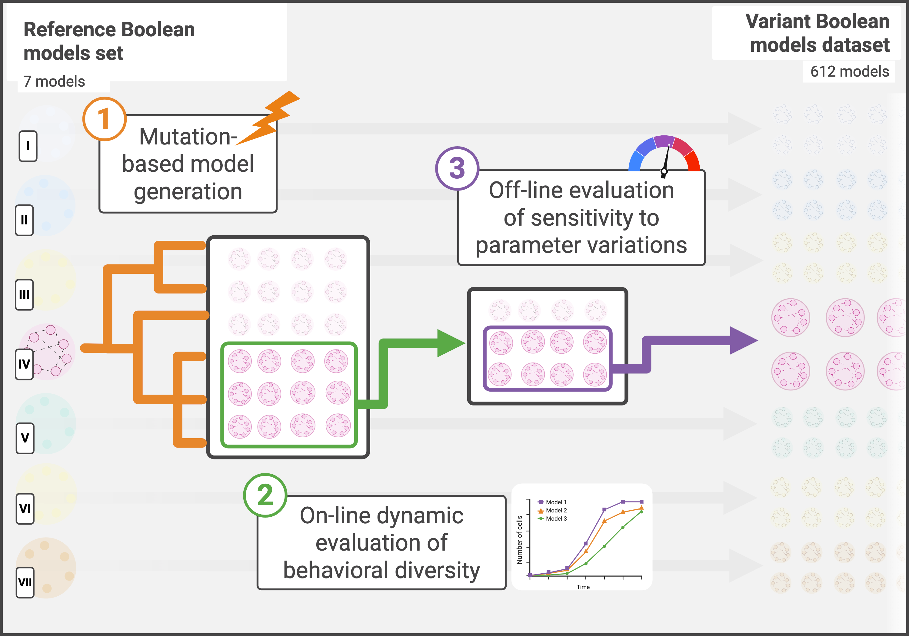

# VBMS: Variant Boolean Models and Multiscale Simulations

The development of computational methodologies for analyzing biological dynamics is constrained by the limited availability and complexity of time-resolved datasets. Acquiring longitudinal data is costly, and its downstream use is often complicated by missing observations or irregular sampling. While large-scale simulation benchmark datasets exist for physical systems, they do not capture the emergent, stochastic, and hybrid multiscale nature of biological biology. 

**VBMS (Variant Boolean Models and Multiscale Simulations)** addresses this gap by providing a curated dataset of simulation-ready intracellular models embedded in a uniform multiscale framework. Designed to accelerate data-driven method development, surrogate modeling, and comparative benchmarking, this resource allows researchers to generate, compare, and analyze multiscale biological simulations under consistent conditions.

Derived from seven open biological reference models, the dataset features:
* **612 variant MaBoSS Boolean regulatory networks:** Filtered from a mutation-based pipeline of 2,122 candidate networks to maximize structural and dynamical diversity. All models are provided with the code required for direct execution within the shared PhysiBoSS/PhysiCell framework.
* **120,000 precomputed time-resolved trajectories:** Generated from 60 representative models under multiple stimulation parameterizations and environmental conditions, dramatically lowering the computational barrier to immediate reuse.

By coupling diverse intracellular Boolean networks with a consistent agent-based multicellular environment, VBMS retains key biological features—such as nonlinearity, stochasticity, feedback, and multiscale coupling—enabling robust, large-scale studies across a broad spectrum of bio-inspired systems.



<br>
<br>


# Table of Contents
- [Overview](#overview)
- [Usage](#usage)
  - [Project Structure](#project-structure)
  - [Environment Setup](#environment-setup)
  - [Running the Workflow](#running-the-workflow)
  - [Remote Execution (HPC)](#remote-execution-hpc)
- [Pipeline Steps](#pipeline-steps)
  - [1. Base Pool Generation (`rule base_pool`)](#1-base-pool-generation-rule_base_pool)
  - [2. Mutation Pipeline & On-line Evaluation (`rule pool`)](#2-mutation-pipeline--on-line-evaluation-rule_pool)
  - [3. Sensitivity Analysis & Sampling (`rule sampling`)](#3-sensitivity-analysis--sampling-rule_sampling)
  - [5. Static Distance Validation (`rule static_distances`)](#5-static-distance-validation-rule_static_distances)
  - [6. Multiscale Simulation Extraction (`rule data_extraction_hpc`)](#6-multiscale-simulation-extraction-rule_data_extraction_hpc)

<br>
<br>
<br>

# Overview

The workflow consists of several key stages designed to generate and validate a structurally diverse dataset of Boolean models and their multiscale simulations:

1. **Base Pool Generation** (rule `base_pool`): Transforms the source biological reference models into a harmonized set of generic Boolean networks. Each model is equipped with a minimal, consistent interface comprising one input node and three output nodes to enable interoperable multiscale simulations.

2. **Mutation Pipeline & On-line Evaluation** (rule `pool`): Applies a stochastic mutation-and-selection process to the base models to create structurally diverse candidate networks. Mutations alter network topology and update rules, such as rewiring logic, replacing operators, and adding nodes. Candidate models are filtered dynamically during generation using a behavioral signature distance threshold to prevent dynamic redundancy.

3. **Sensitivity Analysis & Sampling** (rule `sampling`): Conducts an off-line sensitivity evaluation by simulating the variant models across hundreds of biological contexts. This step uses the PhysiBoSS multiscale framework to evaluate each model under distinct combinations of stimulation and spatial parameters.

4. **Model Filtering** (rule `filtering`): Discards weakly informative models by analyzing their population-level fitness responses across the sampled parameter space. Models are retained only if they demonstrate sufficient absolute and relative variability, evaluated via standard deviation and coefficient of variation thresholds.

5. **Static Distance Validation** (rule `static_distances`): Quantifies the true structural diversity of the curated model collection by converting the Boolean rules into graph representations. It calculates pairwise global distance metrics—DeltaCon, Ipsen-Mikhailov, and Quantum Jensen-Shannon Divergence—to ensure topological distinction.

6. **Multiscale Simulation Extraction** (rule `data_extraction_hpc`): Executes the final, large-scale dataset generation across High-Performance Computing (HPC) resources. It runs a massive grid of parameterizations to extract and save precomputed, time-resolved simulation trajectories for downstream analysis.

<br>
<br>
<br>

# Usage

This project follows the standard Snakemake workflow structure, organizing configurations, rules, and scripts into dedicated directories. 

All workflow executions should be run from the root of the Snakemake pipeline, which is located in `src/dataset_generation`. 

## Project Structure

The repository is organized as follows:

```text
.
├── data/
│   ├── reference_models/       # Initial reference models to mutate
│   ├── boolean_models/
│   │   ├── base_pool/          # Reference models made generic and ready for mutations
│   │   ├── mutated/            # Generated mutated models
│   │   └── filtered/           # Generated mutated models after offline filtering
│   └── multiscale_simulations/ # Results of the multi-scale simulations
├── results/
│   ├── sampling/               # Raw data (sensitivity analysis)
│   ├── filtering/              # Statistics for the sampling step (sensitivity analysis)
│   └── static_distances/       # Raw results and plots for the static distance measures
├── singularity/
│   └── container.def           # Definition file to build the Singularity container
└── src/
    ├── bin/
    │   └── physiboss/          # PhysiBoss executables and source
    └── dataset_generation/     # Root directory to run the Snakemake pipeline
        ├── config/
        │   └── config.yaml     # All configurable hyperparameters and remote settings
        └── workflow/
            ├── env/
            │   └── env.yaml    # Conda environment definition
            ├── rules/          # Directory containing all Snakemake rules (.smk)
            ├── scripts/        # Python scripts called by the rules
            └── Snakefile       # Main Snakemake orchestration file
```

## Environment Setup
You can set up the environment in two ways: using a **Singularity container** (recommended) or **manually via Conda**.

### Using Singularity (Recommended)
A Makefile is provided in the root directory to easily build and launch the container with the correct volume bindings.

To build the container (container.sif):

```bash
make container.sif
```

To launch the interactive shell inside the container:

```bash
make launch_container
```
Note: This automatically binds the necessary PhysiCell configuration directories and your current working directory. From the container shell:
```bash
conda activate VBMS
cd src/data_generation
```

### Manual Setup (Conda)
If you prefer not to use Singularity, you can recreate the environment using the provided YAML file:

```bash
conda env create -f src/dataset_generation/workflow/env/env.yaml
conda activate <env_name>
```

And manually build PhysiCell
```bash
cd src/bin/physiboss/PhysiCell
make
```

### Pipeline Configuration
All hyperparameters and pipeline settings are centralized in src/dataset_generation/config/config.yaml. This file dictates the behavior of the entire workflow. 

The specific hyperparameters of individual steps of the pipeline will be documented below.

<br>


## Running the Workflow
To execute the pipeline, first navigate to the workflow root directory:

```bash
cd src/dataset_generation
snakemake -j<n> all
```

Individual steps of the pipeline can be run using specific rule names:

* `snakemake -j<n> base_pool`: generate the generic models pool.
* `snakemake -j<n> pool`: apply the mutation and online validation pipeline to generate the pool of mutated models.
* `snakemake -j<n> sampling`: extract sampling of multiscale simulation outputs from the pool of models. Note: this step is time-consuming.
* `snakemake -j<n> filtering`: use the output of the sampling step to run the sensitivity analysis and filter the models pool.
* `snakemake -j<n> static_distances`: compute structural diversity measures on the filtered pool.
* `snakemake -j<n> data_extraction_generate_manifest`: extract the multi-scale simulation dataset.


## Remote Execution (HPC)
For computationally intensive tasks (sampling and data extraction), the workflow natively supports remote execution on HPC systems.

Configuring remote execution requires:
* Configuring specific fields in the `config.yaml` file.
* Configuring the HPC server to accept and run incoming jobs.

### Configuring the HPC server

Communication between the machine running the pipeline and the remote HPC server happens through SSH. The pipeline:
* Sends the JOBs data to a specific HPC Server directory though *scp*.
* Runs the job by executing a shell script through SSH.
* Checks for completed and failed jobs by checking specific remote directories.

In order to set up the HPC server:
* Ensure the remote server is accessible through SSH.
* Create directories for `running jobs` (temp directory), for `completed jobs` and for `failed jobs`.
* Create a `submission script` in the HPC server. This scripts must:
  * Accept a CLI argument *job_name*
  * Look for job data in the temp directory.
  * Schedule the job on a SLURM Queue.
  * Move results to the completed job directory, and move failed jobs to the failed jobs directory.

#### Submission Script and Singularity Container

An example submission script (`run_job.sh`) is available in the hpc_setup_helper directory.

This script uses a Singularty container to actually execute the jobs. The definition for the container is provided in `hpc_setup_helper/remote_container.def`


The script must be personalized:
* Set the machine-specific SLURM configuration.
* Set the desired paths for the input and output directories.
* Set the path to the image of the singularity container built with `hpc_setup_helper/remote_container.def`.


### Config.yaml fields

You can configure this by editing the dedicated HPC sections in config.yaml.

Standard HPC execution fields:

```YAML
# Remote execution settings
use_remote: false           # Set to true to enable HPC for the sampling/filtering step
remote_user: "your-user"   # Remote user on HPC
remote_host: "your-HPC-server-URL" # Host address on HPC
remote_url: "your-user@your-HPC-server-URL" # Combination of user and host
remote_results_path: "/home/your-user/.../results" # Where HPC stores results
remote_failed_path: "/home/your-user/.../failed_jobs"      # Where HPC stores failed jobs
remote_temp_path: "/home/your-user/.../masera/jobs"               # Temp dir on the HPC where jobs are sent
hpc_script_name: "your-user/.../run_job.sh"                           # Script on the HPC to launch jobs
max_jobs_stop: 480          # Threshold to stop sending new jobs
max_jobs_resume: 210        # Threshold to resume sending new jobs
```

Data Extraction HPC fields:

```YAML
# Remote execution settings for the data extraction step
extraction_remote_base: "/home/your-user/..."           # Base directory on the HPC
extraction_remote_results: "/home/your-user/.../results" # Directory for extraction results
extraction_remote_script: "/home/your-user/.../run_job.sh" # Remote script for this specific task
```

# Pipeline Steps

## 1. Base Pool Generation (`rule base_pool`)
**Description**: Transforms 7 open biological reference models into a harmonized set of generic Boolean networks. Each model is equipped with a minimal, consistent interface (one input node and three output nodes) to enable interoperable multiscale simulations.
**Inputs**: `data/reference_models`
**Outputs**: `data/boolean_models/base_pool`
**Config Hyperparameters**:
- `NUM_GENERICS_BY_FAMILY`: 12

## 2. Mutation Pipeline & On-line Evaluation (`rule pool`)
**Description**: Applies a stochastic mutation-and-selection process to the base models to create structurally diverse candidate networks. Mutations alter network topology and update rules (e.g., rewiring logic, replacing operators, adding nodes). Candidate models are filtered dynamically during generation using a behavioral signature distance threshold to prevent dynamic redundancy, resulting in 2,122 candidate networks.
**Inputs**: `data/boolean_models/base_pool`
**Outputs**: `data/boolean_models/mutated`
**Config Hyperparameters**:
- `target_number_of_models`: 2115
- `MIN_DISTANCE`: 0.15
- `MAX_TESTED`: 200,000
- `MAX_CREATED_NODES`: 45
- `MIN_MUTATIONS`: 10
- `MAX_MUTATIONS`: 2000
- `MUTATION_P`: Probabilities for different mutation operations (Switch nodes logic, replace logical operator, etc.)

## 3. Sensitivity Analysis & Sampling (`rule sampling`)
**Description**: Conducts an off-line sensitivity evaluation by simulating the variant models across hundreds of biological contexts. Uses the PhysiBoSS multiscale framework to evaluate each model under distinct combinations of stimulation and spatial parameters.
**Inputs**: `data/boolean_models/mutated`
**Outputs**: `results/sampling`
**Config Hyperparameters**:
- `sampling_number_of_contexts`: 215
- `sampling_number_of_subjects`: 2115
- `max_jobs_stop`: 480
- `max_jobs_resume`: 210

#### 4. Model Filtering (`rule filtering`)
**Description**: Discards weakly informative models by analyzing their population-level fitness responses across the sampled parameter space. Models are retained only if they demonstrate sufficient absolute and relative variability. The subset is thus filtered down to the final 612 structurally and dynamically diverse Boolean regulatory networks.
**Inputs**: `results/sampling` (plus the mutated string pool)
**Outputs**: `results/filtering` (statistics and notebook), `data/boolean_models/filtered` (final models)
**Config Hyperparameters**:
- `mean_threshold`: 0.0
- `abs_std_threshold`: 10
- `norm_std_threshold`: 0.05

## 5. Static Distance Validation (`rule static_distances`)
**Description**: Quantifies the true structural diversity of the curated model collection by converting the Boolean rules into graph representations. Calculates pairwise global distance metrics across models (DeltaCon, Ipsen-Mikhailov, Quantum Jensen-Shannon Divergence) to ensure topological distinction.
**Inputs**: `data/boolean_models/filtered`
**Outputs**: `results/static_distances`
**Config Hyperparameters**:
- `STATIC_DISTANCE_NUM_PROCESSES`: 32
- `STATIC_DISTANCE_MAX_GRAPHS`: -1 (uses all graphs)
- `STATIC_DISTANCE_USE_GLOBAL`: 0
- `STATIC_DISTANCE_MEASURES`: DeltaCon, IpsenMikhailov, QuantumJSD

## 6. Multiscale Simulation Extraction (`rule data_extraction_hpc`)
**Description**: Executes the final, large-scale dataset generation across High-Performance Computing (HPC) resources on 60 representative models. It runs a massive grid of parameterizations to extract and save 120,000 precomputed, time-resolved simulation trajectories for downstream analysis.
**Inputs**: Base initial configurations (e.g. `initial_positions.json`)
**Outputs**: `data/multiscale_simulations`
**Config Hyperparameters**:
- `extraction_grid_size`: 2000
- `extraction_max_concurrent`: 100
- `extraction_save_time`: 60
- `extraction_max_retries`: 1
- `extraction_stale_minutes`: 1500